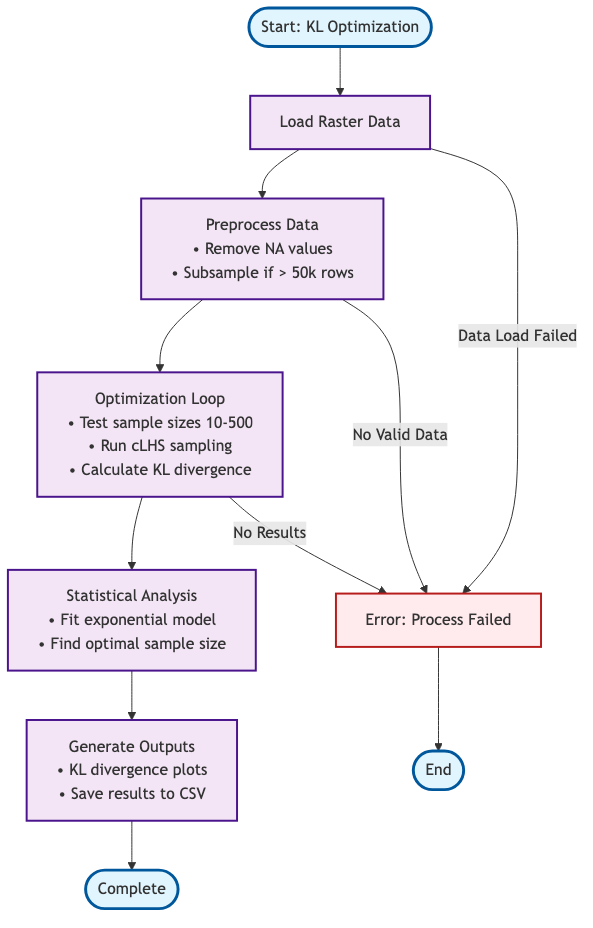

# Sample Size Optimization for cLHS


An R implementation of KL divergence-based sample size optimization for conditioned Latin Hypercube Sampling (cLHS), following the methodology from Malone et al. (2019).

## Overview

This project determines optimal sample sizes for spatial sampling by analyzing the statistical divergence between population and sample distributions. It uses KL (Kullback-Leibler) divergence to quantify how well samples represent the underlying population across multiple environmental variables.

More details can be found in the Medium article: [Generation of soil sampling points using optimized conditional Latin hypercube (Part 1)](https://medium.com/@cmcarbajal/generation-of-soil-sampling-points-using-optimized-conditional-latin-hypercube-part-1-494e644a14c4).



## Features

- **Automated sample size optimization** using KL divergence analysis
- **Spatial raster data processing** with support for multi-layer GeoTIFF files
- **Statistical modeling** with exponential decay curve fitting
- **Comprehensive visualization** including KL divergence plots and CDF analysis
- **Robust error handling** and memory management for large datasets
- **Flexible input formats** supporting single or multiple raster files

## Quick Start

### Prerequisites

Make sure you have R installed with the following packages:

```r
install.packages(c("clhs", "terra", "dplyr", "ggplot2", "minpack.lm"))
```

### Basic Usage

1. **Prepare your data**: Place your raster file(s) in the `data/` directory

   - Single multi-layer file: `data/predictors.tif`
   - Or multiple single-layer files: `data/*.tif`
2. **Run the analysis**:

   ```r
   source("kl_optimization.r")
   ```

The script will automatically execute with default parameters and save results to the `outputs/` directory.

### Custom Parameters

For more control over the optimization process:

```r
results <- run_kl_optimization(
  predictor_path = "data/predictors.tif",
  output_dir = "outputs",
  min_samples = 10,
  max_samples = 500,
  step_size = 10,
  n_replicates = 10,
  probability_threshold = 0.95
)
```

## Methodology

The optimization workflow follows these steps:

1. **Data Extraction**: Load raster data and extract population values
2. **Sampling**: Generate cLHS samples of varying sizes with multiple replicates
3. **KL Divergence Calculation**: Compute divergence between population and sample distributions
4. **Model Fitting**: Fit exponential decay function to KL divergence vs. sample size
5. **Optimization**: Determine optimal sample size using cumulative density function threshold

### Mathematical Model

The relationship between sample size and KL divergence is modeled as:

```
KL(n) = b₁ × exp(-k × n) + b₀
```

Where:

- `n` = sample size
- `b₁`, `b₀`, `k` = fitted parameters
- Optimal size determined when CDF reaches specified threshold (default 0.95)

## Output Files

The analysis generates several output files:

| File                                 | Description                                                           |
| ------------------------------------ | --------------------------------------------------------------------- |
| `kl_raw_results.csv`               | Individual replicate results with sample sizes and KL divergences     |
| `kl_summary_results.csv`           | Aggregated statistics (mean and standard deviation) by sample size    |
| `kl_fitted_curve.csv`              | Exponential model predictions (if fitting successful)                 |
| `kl_divergence_vs_sample_size.png` | Visualization showing KL divergence vs. sample size with fitted curve |
| `kl_cdf_threshold.png`             | CDF analysis plot indicating optimal sample size                      |

## Key Functions

### Core Functions

- `run_kl_optimization()`: Complete end-to-end workflow
- `optimize_sample_size()`: Main optimization engine
- `calculate_kl_divergence()`: KL divergence computation
- `load_predictors()`: Flexible data loading

### Utility Functions

- `load_predictor_rasters()`: Load multiple raster files
- `extract_sample_data()`: Extract values at sample locations
- `save_optimization_plots()`: Manual plot saving

## Configuration

### Default Parameters

| Parameter                 | Default Value | Description                          |
| ------------------------- | ------------- | ------------------------------------ |
| `min_samples`           | 10            | Minimum sample size to test          |
| `max_samples`           | 500           | Maximum sample size to test          |
| `step_size`             | 10            | Increment between sample sizes       |
| `n_replicates`          | 10            | Number of replicates per sample size |
| `n_bins`                | 25            | Histogram bins for KL calculation    |
| `probability_threshold` | 0.95          | CDF threshold for optimal size       |

### Performance Considerations

- Large datasets (>100,000 cells) are automatically subsampled for computational efficiency
- Memory usage is optimized through strategic data handling
- Progress messages provide feedback during long-running optimizations

## Requirements

- **R version**: 4.0 or higher recommended
- **Required packages**:
  - `clhs`: Conditioned Latin hypercube sampling
  - `terra`: Spatial raster data operations
  - `dplyr`: Data manipulation
  - `ggplot2`: Data visualization
  - `minpack.lm`: Non-linear model fitting

## References

Malone BP, Minansy B, Brungard C. 2019. **Some methods to improve the utility of conditioned Latin hypercube sampling**. PeerJ **7**:**e6451** [https://doi.org/10.7717/peerj.6451](https://doi.org/10.7717/peerj.6451)

## License

This project is open source. Please cite appropriately if used in academic work.

## Contributing

Contributions are welcome! Please feel free to submit issues or pull requests.
